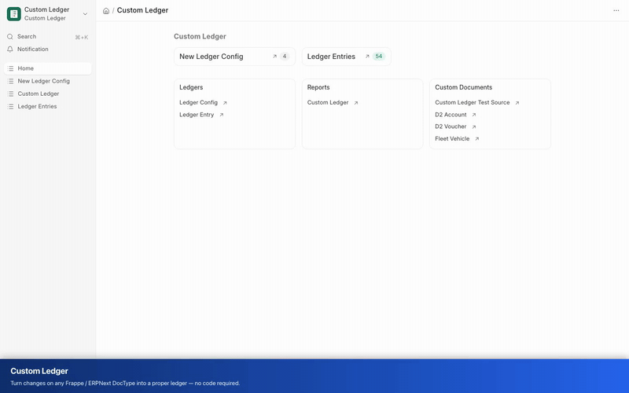

# Custom Ledger

[](https://frappeframework.com/)
[](https://frappeframework.com/)
[](LICENSE)

### Configurable ledgers for any DocType — no code required

*Turn changes on any Frappe/ERPNext DocType into a proper ledger, with running balances, an opening/closing report, and an analytics dashboard. You describe what to track in a Ledger Config; Custom Ledger generates everything else.*

[Quick Start](#quick-start) • [User Manual](USER_MANUAL.md) • [Ledger Types](#ledger-types) • [How it works](#how-it-works) • [Support](#support) • [Privacy Policy](#privacy-policy) • [Terms of Use](#terms-of-use)

---

## Demo



A 80-second walkthrough of both ledger types with their report and dashboard: **Type 1** (a gym member's weight tracked field-by-field) and **Type 2** (a customer's credit balance fed by transactions), including the running-balance report and the analytics dashboard.

▶️ **Full-quality video:** [docs/media/custom-ledger-demo.mp4](docs/media/custom-ledger-demo.mp4)

---

## Why Custom Ledger

ERPNext's Stock Ledger and General Ledger are powerful, but they're hardcoded. If you want the same kind of dated, auditable, running-balance history for anything else — a member's weight, a customer's prepaid credit, a project's budget burn — you normally have to build a Frappe app from scratch.

Custom Ledger closes that gap. Define a **Ledger Config**, and it automatically maintains the entries, the report, the dashboard, and a per-record drill-in button. Add a new kind of ledger by creating a config, never by writing code.

## Features

- **Two ledger types** — track a single field as it changes, or maintain a running balance fed by multiple transaction types.
- **Automatic ledger entries** — submitted, immutable, with value, delta, and running balance per entry.
- **Custom Ledger report** — opening balance, every movement, closing balance, color-coded deltas, narration, and dimensional columns driven by your config.
- **Auto-generated dashboard** — closing balance, net change, totals, record count, a balance-over-time chart, and group breakdowns, all filterable.
- **View Ledger button** — one click from any source record to its pre-filtered ledger.
- **Dimensions** — slice reports and charts by any link fields you nominate (diet plan, trainer, warehouse, item group, etc.).
- **Config-driven throughout** — the report and dashboard adapt to each config automatically; there is no per-ledger code.

## Ledger Types

| Type | What it watches | Example |
| --- | --- | --- |
| **Track changes to a field** | A single numeric field on one DocType; every change logs an entry. | A gym member's weight over time. |
| **Track balance from transactions** | Multiple feeder DocTypes that add to or deduct from a balance held on a separate carrier DocType. | A customer's credit balance, fed by Credit Purchases and Invoices. |

## How it works

1. **Create a Ledger Config.** Pick a ledger type, the DocType(s) to watch, the numeric field, the posting date, and any dimensions.
2. **Custom Ledger captures changes.** For *Track changes to a field*, updating the tracked field creates an entry. For *Track balance from transactions*, submitting a feeder creates an entry and updates the carrier's balance.
3. **Read the ledger.** Open the Custom Ledger report or the dashboard, or click **View Ledger** on any record.

For step-by-step setup of both ledger types, see the [User Manual](USER_MANUAL.md).

## Requirements

- Frappe Framework v15 or v16
- Python 3.10–3.14
- ERPNext is optional — only needed for the "create Journal Entry / Stock Entry" actions from a Ledger Entry.

## Installation

### On a local bench

```bash
cd ~/frappe-bench
bench get-app custom_ledger https://github.com/umairsy/custom_ledger
bench --site <your-site> install-app custom_ledger
bench --site <your-site> migrate
```

### On Frappe Cloud

1. Push this repository to your GitHub account.
2. In Frappe Cloud, open your bench → **Apps** → **Add App** → **GitHub**, and select this repository.
3. Deploy. Frappe Cloud reads `pyproject.toml` to verify version compatibility.

## Quick Start

Track a single field as it changes:

1. Open **Ledger Config → New**.
2. Set **Ledger Type** to *Track changes to a field*.
3. Set **Source DocType** (e.g. *Gym Member*) and **Tracked Field** (e.g. *Weight*).
4. Set **Posting Date Field** (e.g. *weight_reading_date*).
5. Save, then update the tracked field on a record — a ledger entry appears automatically.
6. Open the **Custom Ledger** report (or click **View Ledger** on the record) to see opening balance, movements, and closing balance.

Maintain a running balance from transactions:

1. Add a read-only Currency field to the carrier DocType (e.g. *Credit Balance* on *Customer*).
2. Create a Ledger Config with **Ledger Type** = *Track balance from transactions*.
3. Set **Balance Carrier DocType** and **Balance Field**.
4. Add **Transaction Sources** — one row per feeder, each with an amount field, direction (ADD/DEDUCT), and the link field pointing at the carrier.
5. Submit a feeder — the carrier's balance updates and an entry is logged.

## Documentation

- [User Manual](USER_MANUAL.md) — full feature guide with both use cases, the report, and the dashboard.

## Compatibility

| Branch | Frappe | Python | Role |
| --- | --- | --- | --- |
| [`main`](https://github.com/umairsy/custom_ledger/tree/main) | v15 & v16 | 3.10–3.14 | Primary development line — installs on both versions. |
| [`version-15`](https://github.com/umairsy/custom_ledger/tree/version-15) | v15 | 3.10–3.14 | Frappe v15 release line. |
| [`version-16`](https://github.com/umairsy/custom_ledger/tree/version-16) | v16 | 3.10–3.14 | Frappe v16 release line. |

The application code is identical across branches — Custom Ledger uses only stable core Frappe APIs that behave the same on v15 and v16. See [docs/VERSIONING.md](docs/VERSIONING.md) for the branch model and how changes are kept in sync.

## Development

Run the test suite:

```bash
bench --site <your-site> set-config allow_tests true
bench --site <your-site> run-tests --app custom_ledger
```

Every push and pull request runs the unit tests and a Semgrep scan against
[Frappe's official security rules](https://github.com/frappe/semgrep-rules)
(see [`.github/workflows/ci.yml`](.github/workflows/ci.yml)). To run the scan locally:

```bash
git clone --depth 1 https://github.com/frappe/semgrep-rules.git
semgrep --config ./semgrep-rules/rules custom_ledger
```

## Support

Custom Ledger is a free, open-source, community-supported project. There is no
commercial support contract and no service-level agreement.

- **Questions, bugs, and feature requests:** please open an issue on GitHub at
  [github.com/umairsy/custom_ledger/issues](https://github.com/umairsy/custom_ledger/issues).
  Maintainers respond on a best-effort basis.
- **Using it in production?** Because this is a volunteer-maintained open-source
  app with no guaranteed support, we **recommend forking the repository** if you
  depend on it for a product or business. A fork lets you pin a known-good
  version, apply your own fixes and customisations, and control your own upgrade
  schedule independently of upstream changes. Contributions back via pull request
  are always welcome, but never required.

## Privacy Policy

Custom Ledger is a self-hosted Frappe application. It is designed with privacy by
default:

- **No data leaves your site.** All ledger configs, entries, reports, and
  dashboards are stored entirely within your own Frappe/ERPNext site database.
- **No telemetry or tracking.** The app does not collect analytics, send usage
  data, phone home, or transmit any information to the maintainers or any third
  party.
- **No external services.** Custom Ledger makes no outbound network calls. It
  operates only on the DocTypes and records inside your own installation.
- **You are the data controller.** Any personal or business data processed by the
  ledgers you configure is governed entirely by your organisation's own privacy
  practices and your site's access controls. The maintainers never receive,
  store, or have access to your data.

Because the maintainers never receive any user data, there is nothing for us to
retain, share, or delete on your behalf.

## Terms of Use

Custom Ledger is licensed under the **GNU General Public License v3.0 (or later)**;
your use, modification, and distribution of the software are governed by that
license (see [LICENSE](LICENSE)).

- **Provided "as is".** The software is provided without warranty of any kind,
  express or implied, including but not limited to the warranties of
  merchantability, fitness for a particular purpose, and non-infringement.
- **No liability.** In no event shall the authors or copyright holders be liable
  for any claim, damages, or other liability arising from the use of the software.
- **Your responsibility.** You are responsible for testing the app against your
  own data and workflows before relying on it, for maintaining backups, and for
  complying with all laws applicable to the data you process with it.
- **Financial data disclaimer.** Custom Ledger helps you record and report
  balances, but it is not a certified accounting system. Verify any figures used
  for accounting, tax, or regulatory purposes independently.

By installing or using Custom Ledger you agree to these terms and to the terms of
the GPL-3.0 license.

## License

Custom Ledger is free software, released under the
[GNU General Public License v3.0 (or later)](LICENSE). You may redistribute and/or
modify it under the terms of that license. It is distributed in the hope that it
will be useful, but WITHOUT ANY WARRANTY; see the LICENSE file for full details.

## Contributors

Custom Ledger Contributors
